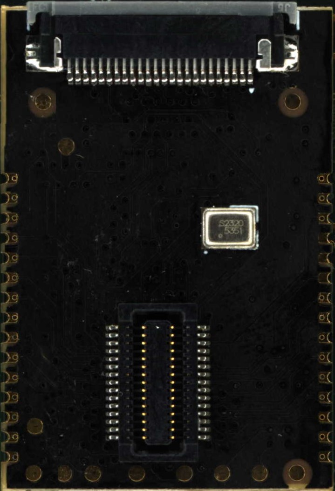

# SoM Mechanical Details

The SoM is designed to be plugged into a connector on the host board or to be soldered down using the castellations to reduce system cost. Note that since the on-board microphone is bottom ported, this requires that the soldered down version not have a microphone which is an alternate part. Please contact us at sales.at.tinyvision.ai for details.

## Mechanical drawing
