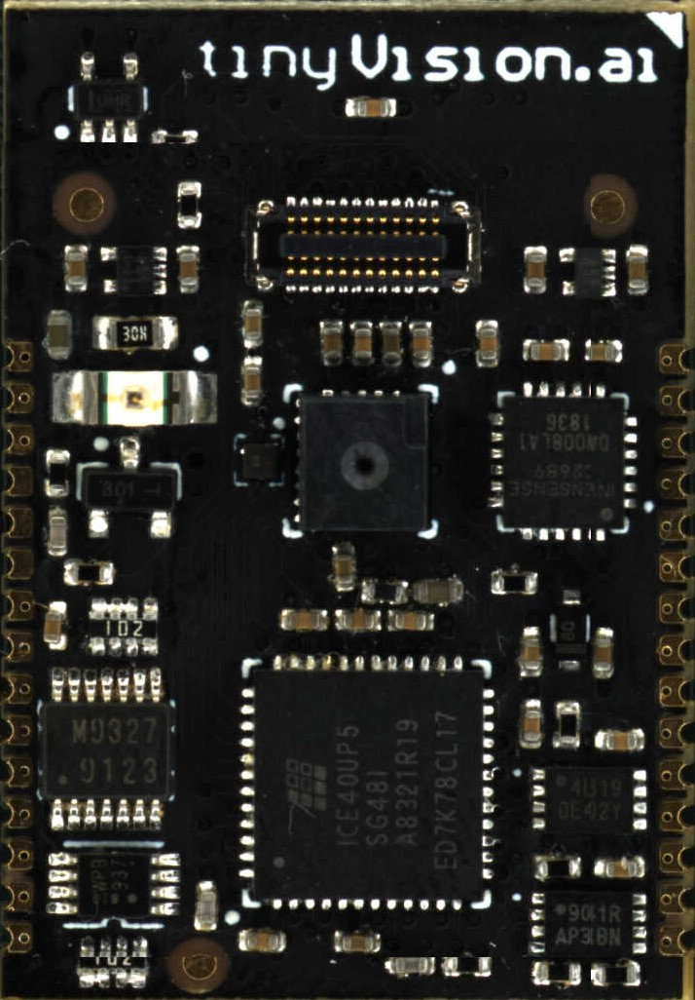

<!img src="../resources/images/Module_back.jpg" alt="Module Back" width="100"/-->

# SoM Details

- [High level interconnect](../resources/images/SoM_interconnect_details.png)
- [Detailed SoM specification](./SoM_Specification.md).
- [Schematics](./Schematics)
- [Verilog examples](./RTL)
- Sensors
  - [Image sensor data](./Misc/Images)
  - [Microphone data](Misc/Audio)
  - [IMU data](./Misc/IMU)
- [STEP & DXF files](../resources/som_details/)
- [Developer kit details](../resources/images/SoM_devkit_details.png)

## Mechanical
The SoM is designed to be plugged into a connector on the host board or to be soldered down using the castellations to reduce system cost. Note that since the on-board microphone is bottom ported, this requires that the soldered down version not have a microphone which is an alternate part. Please contact us at sales.at.tinyvision.ai if this is of interest.
